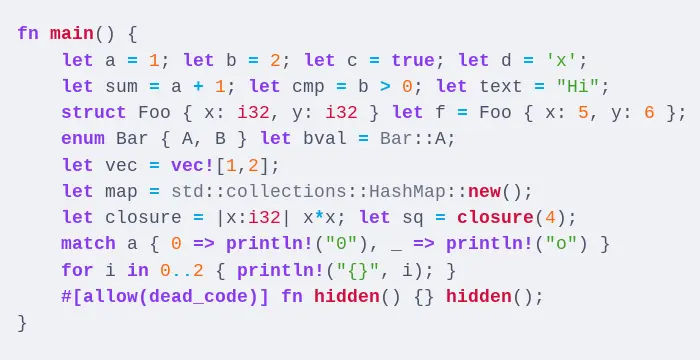
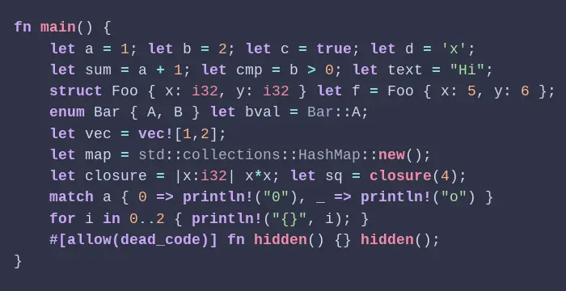
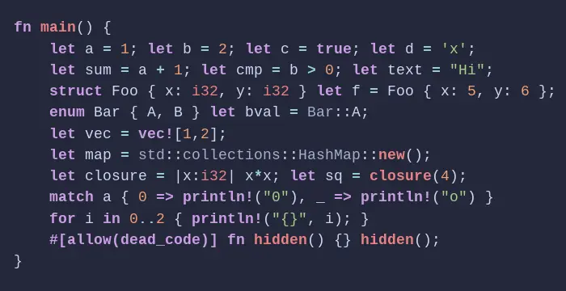

<h3 align="center">
	 
	
	Catppuccin for <a href="https://jekyllrb.com/docs/liquid/tags/#stylesheets-for-syntax-highlighting">jekyll-pygments</a>
	
</h3>

	
	
	

	

## Previews

🌻 Latte

🪴 Frappé

🌺 Macchiato

🌿 Mocha

## Usage

1. Download the flavor of your choice from [`css/`](css/) or generate the `.css` files from [`jekyll-pygments.tera`](jekyll-pygments.tera) using [Whiskers](https://github.com/catppuccin/whiskers).
2. Import the `jekyll-pygments-<flavor>.css` into your Jekyll website as described in the [official documentation](https://jekyllrb.com/docs/liquid/tags/#stylesheets-for-syntax-highlighting).

## 💝 Thanks to

- [neuroconvergent](https://github.com/neuroconvergent)

&nbsp;

	

	Copyright &copy; 2021-present <a href="https://github.com/catppuccin" target="_blank">Catppuccin Org</a>

	

